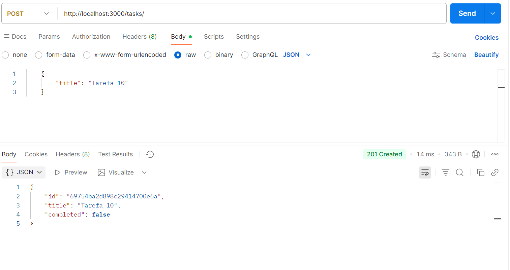
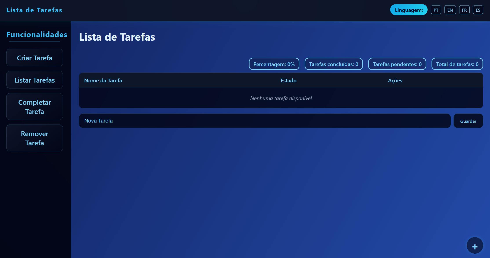

# Create Task

## Analysis

### Functional Requirements
- The user must be able to create a new task.
- Each task must have a required title (string) and an optional completion status (boolean, default: false).
- status = false, means "not completed".
- status = true, means "completed".

### Use Cases
- **Main Scenario**: The user enters a title for the task and confirms creation. The task is added to the list with "not completed" status.

- **Alternative Scenario**: If the title is empty, display an error and prevent creation.

### Validations
- Title: Required field, not empty.
- Status: Boolean, default false.

## Design

### Data Model
```
interface Task {
  id: number;
  title: string;
  completed: boolean;
}
```

### REST Request Type
- **Method:** POST
- **Endpoint:** /tasks
- **Type:** Implementation
- **Description:** Create a Task


## POST with postman


## Frontend Create Task

