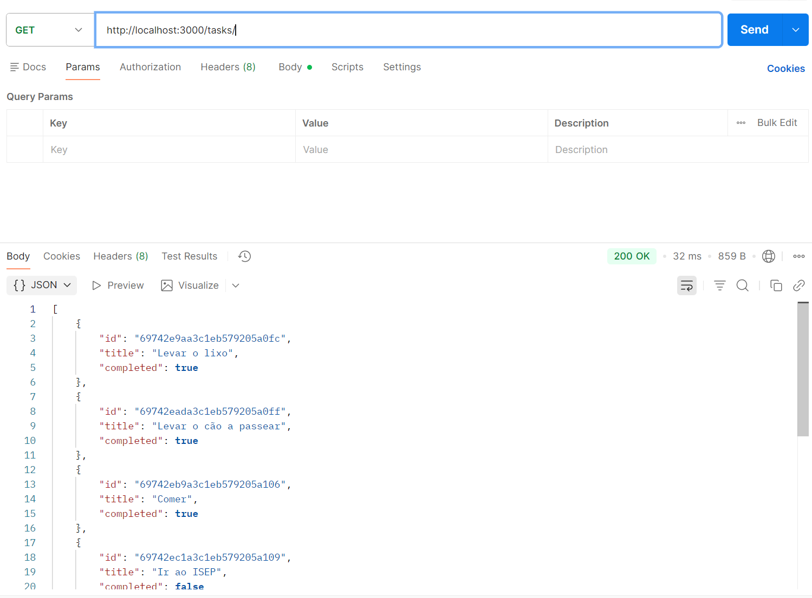

# List Tasks

## Analysis

### Functional Requirements
- The user must be able to view all existing tasks in the list.
- Each task displays its title and completion status.
- Tasks should be listed in a readable format.

### Use Cases
- **Main Scenario**: The user requests to list tasks. The system retrieves and displays all tasks from storage.
- **Alternative Scenario**: If no tasks exist, display an empty list or a message indicating no tasks.

### Validations
- Ensure tasks are retrieved correctly from the data source.
- Handle cases where the list is empty.

## Design

### Data Model
```
interface Task {
  id: number;
  title: string;
  completed: boolean;
}
```

### REST Request Type
- **Method:** GET
- **Endpoint:** /tasks
- **Type:** Implementation
- **Description:** List all Tasks

## GET with postman


## Frontend Create Task

