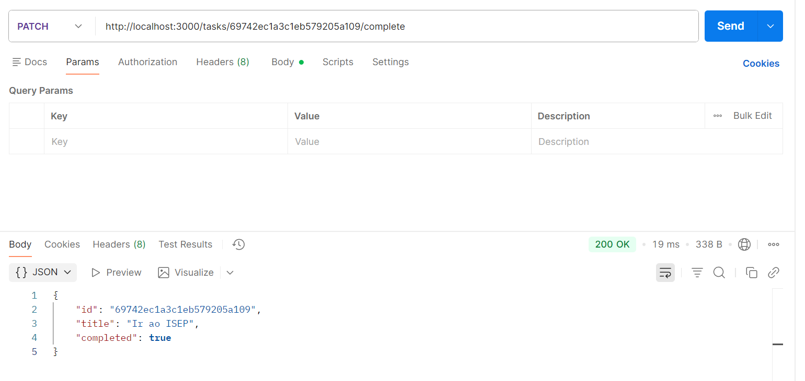
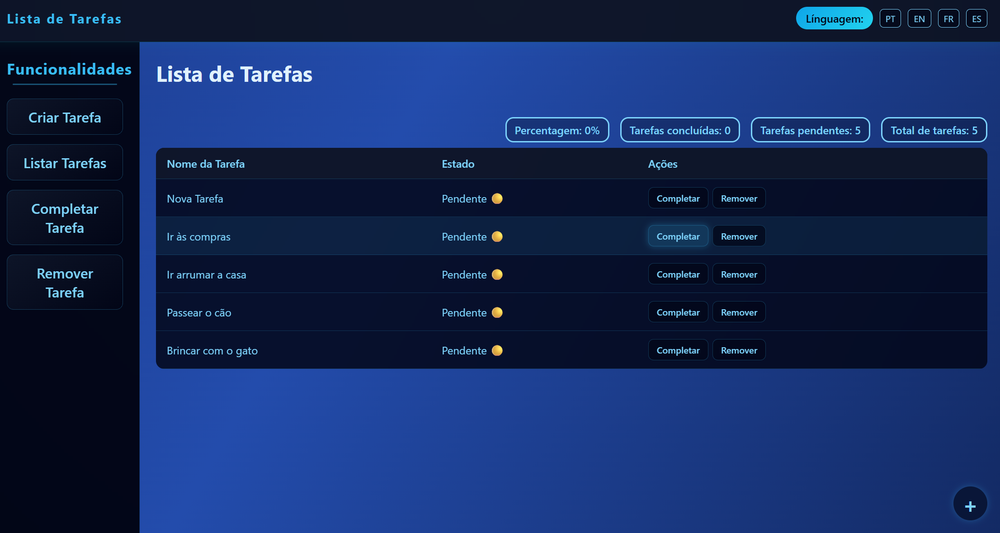

# Mark as Completed

## Analysis

### Functional Requirements
- The user must be able to mark an existing task as completed.
- The task's status changes from false (not completed) to true (completed).
- The task must exist in the list.

### Use Cases
- **Main Scenario**: The user selects a task and marks it as completed. The status updates and the list refreshes.
- **Alternative Scenario**: If the task does not exist, display an error.

### Validations
- Task ID: Must be valid and exist.
- Status: Only update if currently false.

## Design

### Data Model
```
interface Task {
  id: number;
  title: string;
  completed: boolean;
}
```

### REST Request Type
- **Method:** PATCH
- **Endpoint:** /tasks/:id/complete
- **Type:** Implementation
- **Description:** Mark a Task as completed

## PATCH with postman


## Frontend Create Task


